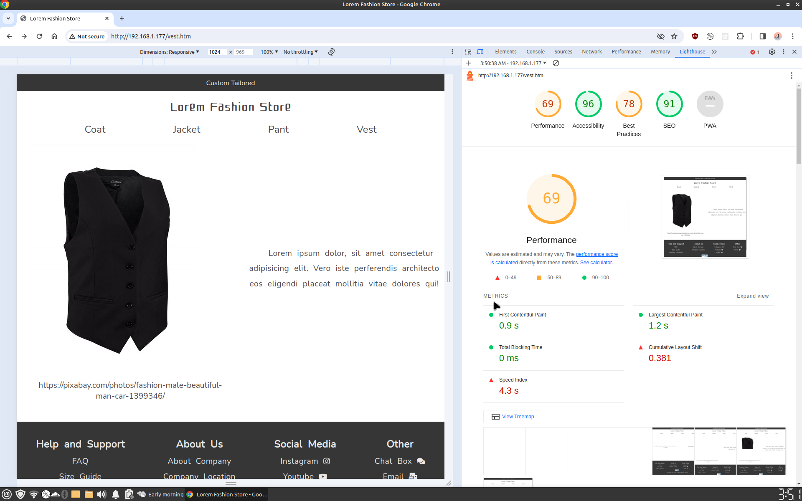

# Repository Overview
This repository contains 4 branches, each showcasing modifications to the same simple website to demonstrate and differentiate the advantages and drawbacks of multiple page server, multiple page Arduino server, Tailwind CSS, and SSR with Next.js.

## Branch: main 
This branch features a vanilla HTML/CSS/JavaScript setup for a basic multiple-page website.

https://mrfatihasci.github.io/fashion-store/

## <strong>Branch: arduino</strong>
In this branch, you will find the Arduino server-side code that responds to client requests, along with the vanilla HTML/CSS/JS code for the same website as in the main branch.
#### Arduino as a server has its limitations due to:
While Arduino serves as a reliable platform, there are certain limitations to be aware of:

    -   Single-thread CPU: affects concurrent processing of multiple requests.

    -   Synchronous SPI Bus Communication: Communication between Arduino and the Ethernet shield relies on synchronous SPI, impacting communication speed.

    -   Embedded SD Card Speed

    -   No TLP Support for HTTPS:

    -   No Node.js Server: The absence of a Node.js server restricts serving only multiple pages.
#### Advantages:

    -   IO Pins with Analog and PWM Capabilities: ideal for smart home projects,

    -   Learning Web Development: it is great for learning web development, since it requires you to write your own back-end code from scratch(or template)
#### Low Performance:

## Branch: tailwind
The tailwind branch includes an installation guide for Tailwind CSS and its plugin, along with the HTML/JS code for the same website as in the main branch.

## Branch: nextjs
This branch comprises Next.js project codes for the website featured in the main branch.